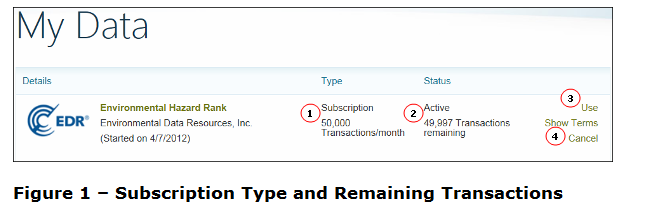

  
<properties 
   pageTitle="understand subscriptions" 
   description="How to understand subscriptions" 
   services="cloud-services" 
   documentationCenter="" 
   authors="kevinscharpenberg" 
   manager="manager-alias" 
   editor=""/>

<tags
   ms.service="marketplace"
   ms.devlang="na"
   ms.topic="article"
   ms.tgt_pltfrm="na"
   ms.workload="data-services" 
   ms.date="02/16/2015"
   ms.author="kevsch"/>
#   Understand Subscriptions 

 -----------

This topic covers the various pricing models you find on the Windows Azure Marketplace (WAM).

 -----------
Sections in This Topic

<table>

<tr><td>Section</td><td>Description</td>
</tr><tr><td>Matrix of Costs and Limits
</td><td>Matrix of subscription costs (free/paid) and subscription limit (unlimited/limited) availability.
</td>
</tr><tr>
<td>Free Subscriptions
</td><td>Determine if a dataset subscription is free and if it has transaction limits, if any, apply to its use. 
</td>
</tr><tr>
<td>Paid Subscriptions
</td><td>Find subscription costs and transaction limits.
</td>
</tr><tr>
<td>Promotional Discounts
</td><td>Enter a promotion code from a publisher to receive discounted pricing.
</td>
</tr><tr>
<td>Transactions
</td><td>Each query counts as a transaction against your monthly limit.
</td>
</tr><tr>
<td>Upgrade a Subscription
</td><td>Change your subscription to one that better meets your needs.
</td>
</tr><tr>
<td>Cancel a Subscription
</td><td>Cancel a subscription you no longer need.
</td>
</tr><tr>
<td>Select a Currency
</td><td>Beginning with Service Update 2 (SU2) in May 2011 the Marketplace supports billing in currencies other than U.S. dollars.  See http://go.microsoft.com/fwlink/?LinkID=217257 for more information.
</td>
</tr>
</table>

###Matrix of Costs and Limits

<table>
<tr>
<td>Free Subscription</td><td>Paid Subscription</td>
</tr><tr>
<td>Yes – some publishers provide their data for free but limit the number of monthly transactions. For example any of the Zillow datasets are free and limited.   

A limited free subscription is any offer with a price of $0.00 and a stated monthly transaction maximum.
</td><td>Yes – most paid subscriptions are limited. Some publishers offer multiple price/transaction limits.   

A limited paid subscription is any offer that has both a monthly cost and stated monthly transaction maximum.
</td>
</tr><tr>
<td>Yes – public data is most often provided free on an unlimited basis.  

An unlimited free subscription is any offer that has a price of $0.00 and no stated transaction limit.
</td><td>Yes – some publishers offer an unlimited transactions option.  

An unlimited paid subscription is any subscription that has a monthly cost but no transaction limits stated. 
</td>
</tr><tr>
<td>N/A – the subscription is free so there is no need for a trial.
</td><td>Sometimes – some publishers provide trial subscriptions, some do not.  

A trial subscription offer has a price of $0.00 and states that the offer is a trial. 
</td>
</tr><tr>
<td>N/A – the subscription is free so there is no need for a promotional discount.
</td><td>Sometimes a publisher offers discounted pricing for an offering that requires entering a promotion code. The discounted price is shown after you choose a tier to subscribe to and enter the promotion code, but before the purchase is completed.
</td>
</tr>
</table>

###Free Subscriptions
Generally speaking, free subscriptions are either public data or, if private data, might be restricted to personal, noncommercial use. Read the terms of use for specific restrictions on the offering. If you select a free subscription, you are not charged to use the dataset. 

Some free subscription offers allow an unlimited number of transactions, others set transaction limits. The monthly transaction limits are stated immediately below the word **Subscription**. (Figure 1.1) Transaction counts include any data access using the Service Explorer (see the topic [Explore a Dataset with Service Explorer](./marketplace-data-market-explore-a-dataset-with-service-explorer.md)), applications that allow you to import data from the Marketplace, and applications you create or purchase. (See Transactions on how to determine your subscription limits and remaining transactions.) See Figure 1.1 and 1.2.

If your subscription has a limited number of transactions, once you reach the transaction limit for the month, no additional transactions are processed until either the next month when your remaining transactions is reset to the monthly limit, or until you upgrade to a paid subscription. (See **Upgrade a Subscription** below). You are not automatically upgraded to a paid subscription.

Some data publishers offer both free and paid subscriptions. There might also be a number of different paid subscription levels with different costs and different transaction limits. Be sure to select the offer that is most suited to your anticipated needs.

Some publishers of paid subscriptions offer free trial subscriptions you can use to test the suitability of the dataset for your needs before you commit to subscribing. 

###Paid Subscriptions
A paid subscription is any subscription for which there is a monthly fee. When you purchase a Paid Subscription, you are immediately charged for the first month's use. You are charged the amount shown next to the offer on the subscription page (plus applicable taxes). This monthly charge is made each month on the same calendar date as your original purchase until you cancel the subscription.

A publisher can designate specific data series in a subscription as not counting toward your monthly transaction total. This is designated under the Details tab on the subscription page. (See Figure 1.4 in [Pre-Examine the Dataset](./marketplace-data-market-subscribe-to-a-data-offer.md).)

There are two types of Marketplace paid subscriptions – Unlimited and Limited.

####Paid Unlimited Subscriptions  
A paid unlimited subscription is any subscription that has a monthly cost and unlimited transactions per month. 

You are charged a monthly access fee and have unlimited access to the dataset during your subscription term (subject to reasonable limits). This includes using the Service Explorer (see the topic [Explore a Dataset with Service Explorer](./marketplace-data-market-explore-a-dataset-with-service-explorer.md)), applications that allow you to import data from the Marketplace, and applications you create.

####Paid Limited Subscriptions  
If you subscribe to a Limited Subscription, you are charged a monthly access fee and your access to the dataset is set to a predefined number of transactions in a month. Once you reach this transaction limit in a month, you no longer have access to the dataset until you either upgrade or the next billing period begins. 

####Trial Subscriptions  
Some data publishers offer free trial subscriptions. Trial subscriptions permit you to try out the dataset to ensure that it meets your needs before you commit to a paid subscription. If a dataset is available for a 30 day free trial, that option is listed along with the paid variants.

	*important
	If you subscribe to a free trial subscription and cancel before the end of the trial period, you are not billed. If you cancel after the trial period is over, you are automatically billed for the month's use.

###Promotional Discounts
A publisher can offer discounted pricing for an offer. To receive the discount you must have a promotion code, which you enter during the purchase process. After you enter the promotion code, the regular price and discounted price are displayed. If you want to purchase the offering at the discounted price, continue the purchase process. If you do not want to subscribe, cancel the purchase.

If you purchase an offering with a time-limited discount, you receive an email 15 days before the end of the promotional period. The email reminds you that the discount price is ending.

If the subscription required you to enter personal billing information the subscription continues with you being billed at the normal rate.

If the subscription did not require you to enter personal billing information, access to the offering is terminated at the end of the discount period. You can then subscribe to the offering at the normal rate.

###Transactions
Limited subscriptions always have an upper limit on the number of transactions that can be processed in a month. Once you reach the transaction limit, no additional transactions are processed. You can upgrade to a subscription with more transactions or wait until the next month when the transaction count resets. Unused transactions in one month do not roll over to the next month.

If a publisher designates one or more data series in a subscription as a free data series, it is indicated under the Details tab on the subscription page. See Figure 1.4 in [Pre-Examine the Dataset](./marketplace-data-market-subscribe-to-a-data-offer.md).
	
***Transaction***  
A transaction is one query in the Marketplace Service Explorer or one valid response from the Marketplace API. A transaction returns up to 100 records. If your query requests data that returns more than 100 records you are charged for each transaction. 
For example: If your application runs a query that returns 100 or fewer records that counts as one transaction. If the query returns 101 records that counts as two transactions. If the query returns 201 records that counts as three transactions.

	*Caution
	An application can perform multiple transactions without explicit action on your part. If you use Limited Subscriptions with these applications, you are charged for each transaction and can reach your transaction limit for the subscription faster than you anticipated.

###Find out how many Transactions Remain for this Billing Period
1. Sign in to the Marketplace.

2. Click the **My Data** tab.

3. Find the **Type** and **Status** columns for subscription you are interested in.

	- The **Type** column tells you this is a Limited Subscription and the number of transactions you get each month (Figure 1.1).

	- The **Status** column tells you this is an Active subscription and the number of transactions you have remaining for the current month (Figure 1.2).

			*Important
			It can take up to 15 minutes for the remaining transaction count to update after you run a query.

###Upgrade a Subscription
If you discover that your subscription does not provide you with enough transactions, you can upgrade to a subscription with a higher transaction limit.
 When you upgrade a subscription:

- Transactions remaining on your old subscription are not added to your new subscription. 

- You pay full price for the new subscription, even though you have unused transactions on your old subscription.

####Process to Upgrade a Subscription
1. Sign in to the Marketplace.

2. Click the **My Data** tab.

3. Click **Use** behind the subscription you want to upgrade. (Figure 1.3)

4. In the right-hand pane all the available subscriptions are listed with your subscription grayed out. Click the radio button for the subscription you want to upgrade to.

5. If you want to upgrade, click **OK** on the dialog box. If you do not want to upgrade, click **Cancel**.
	
		*Important
		Carefully read the dialog box before you upgrade as there are billing and use implications.

###Cancel a Subscription
If you want to switch between offers for the same dataset, cancel your existing subscription before you purchase the new offer. If your current subscription is a paid subscription, your subscription continues in effect until the end of the current billing period. If you need the cancellation to be effective immediately contact us at [https://support.microsoft.com/oas/default.aspx?gprid=17024&st=1&wfxredirect=1&sd=gn](https://support.microsoft.com/oas/default.aspx?gprid=17024&st=1&wfxredirect=1&sd=gn.).

No refund is given if you cancel before the end of a billing period or for unused transactions in a billing period.

1. Sign in to the Marketplace.

2. Click the **My Data** tab.

3. Find the subscription you want to cancel.

4. Click **Cancel** to the right of the dataset name and status (Figure 1.4). You can use this subscription until the end of the current billing period or your transaction limit is reached – whichever occurs first.

If you would like to cancel your subscription immediately so you can purchase a new subscription go to [https://support.microsoft.com/oas/default.aspx?gprid=17024&st=1&wfxredirect=1&sd=gn](https://support.microsoft.com/oas/default.aspx?gprid=17024&st=1&wfxredirect=1&sd=gn) to file a ticket with our customer support.

###Subscription Support
For subscription support please visit [Microsoft Online Support](https://support2.microsoft.com/common/international.aspx?RDPATH=%2foas%2fdefault.aspx%3fgprid%3d17024%26st%3d1%26wfxredirect%3d1%26sd%3dgn).

 -----------
##See Also

###Tasks
Subscribe to a Data Offer  
Explore a Dataset with Service Explorer
